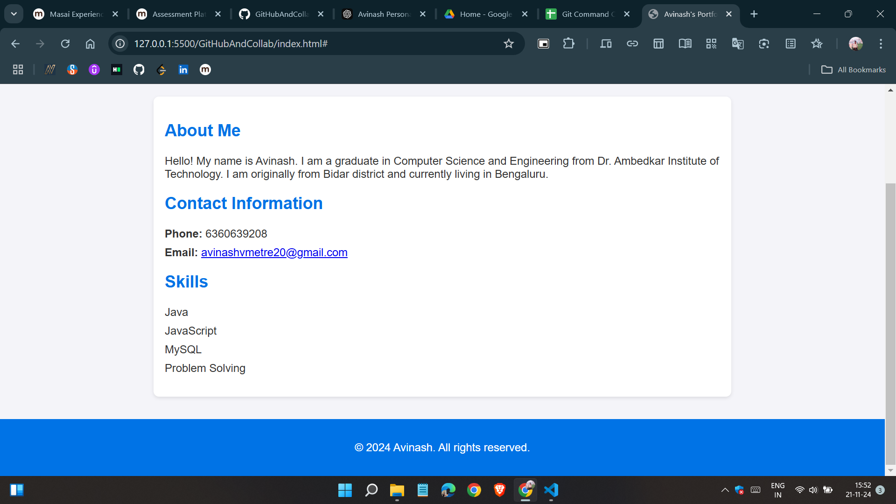
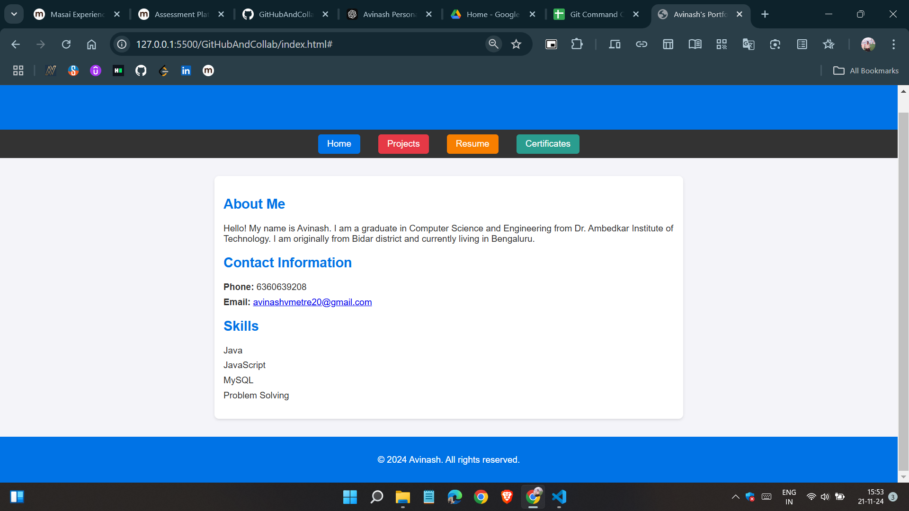

# Avinash's Portfolio Website

Welcome to my personal portfolio website! This project is a simple, static website designed to showcase my background, skills, and contact information.

## Purpose
The main purpose of this portfolio is to:
- Provide an online presence where I can highlight my professional details.
- Serve as a platform to share my skills and achievements.
- Make it easier for potential employers, collaborators, and friends to reach me.

## Features
- **About Me Section**: Details about my education, location, and a brief introduction.
- **Contact Information**: My phone number and email address for easy communication.
- **Skills**: A list of technical skills I have expertise in, such as Java, JavaScript, MySQL, and problem-solving.

## Technologies Used
This project is built using:
- **HTML5**: For the structure of the website.
- **CSS3**: For styling and enhancing the appearance.

## How to Set Up Locally
To view this project locally, follow these steps:
1. Clone this repository to your local machine:
   ```bash
   git clone https://github.com/Avinashvmetre20/githubandcollab.git

## Creating branch
To add updated code:
- In local system add command to create the branch
  ```bash
  git branch header


## Screenshots

### Before adding header 


### After adding header

